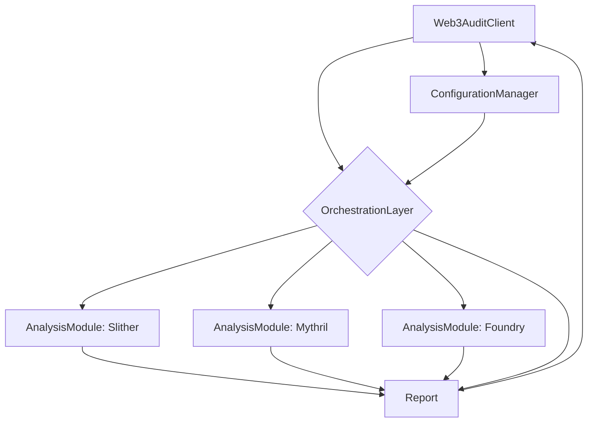

# Web3AuditMCP Design Document

## 1. Introduction

Web3AuditMCP is a comprehensive, autonomous smart contract auditing tool designed to enhance the security and reliability of Web3 projects. It integrates the strengths of leading static and dynamic analysis tools, including Slither, Mythril, and Foundry, with a powerful orchestration layer that automates end-to-end audit plans. This document outlines the architectural design, component interfaces, and implementation plan for Web3AuditMCP.

## 2. Goals and Objectives

*   **Comprehensive Audits:** To provide a holistic security assessment by combining static analysis, symbolic execution, and fuzzing.
*   **Automation:** To automate the entire audit process, from target identification to report generation.
*   **Extensibility:** To create a modular and extensible framework that allows for the easy integration of new analysis tools and techniques.
*   **Configuration:** To offer a highly configurable client that allows users to customize audit plans, select tools, and define security policies.
*   **Structured Findings:** To produce detailed and actionable audit reports with structured findings, including vulnerability descriptions, severity levels, and remediation recommendations.

## 3. System Architecture

Web3AuditMCP will be built upon a modular architecture consisting of the following key components:

*   **Orchestration Layer:** The core of the system, responsible for managing the audit lifecycle, coordinating the execution of analysis modules, and aggregating the results.
*   **Analysis Modules:** A collection of individual modules that perform specific security analysis tasks. Each module will wrap an existing tool (e.g., Slither, Mythril) or implement a custom analysis technique.
*   **Configuration Manager:** A centralized component for managing all system configurations, including audit plans, tool settings, and security policies.
*   **Ollama Client:** An enhanced version of the `ollm-crypt-sec` client, tailored for smart contract auditing. It will provide an interactive command-line interface (CLI) for users to control the audit process and view the results.
*   **Reporting Engine:** A module responsible for generating structured audit reports in various formats (e.g., Markdown, JSON).

## 4. Tool Interfaces

### 4.1. Orchestration Layer API

The Orchestration Layer will expose a simple API for the Ollama Client to interact with. The API will include the following methods:

*   `start_audit(config: dict) -> str:`: Starts a new audit with the given configuration. Returns an audit ID.
*   `get_audit_status(audit_id: str) -> dict:`: Retrieves the status of an ongoing audit.
*   `get_audit_results(audit_id: str) -> dict:`: Retrieves the results of a completed audit.

### 4.2. Analysis Module Interface

Each Analysis Module will implement a common interface to ensure interoperability with the Orchestration Layer. The interface will consist of a single method:

*   `analyze(target: str, config: dict) -> dict:`: Analyzes the specified target (e.g., a smart contract file or a Git repository) with the given configuration. Returns a dictionary of findings.

## 5. Implementation Plan

The development of Web3AuditMCP will be divided into the following phases:

1.  **Phase 1: Core Implementation (Current Focus)**
    *   Implement the core Orchestration Layer.
    *   Develop the Configuration Manager.
    *   Create the initial version of the Ollama Client.
2.  **Phase 2: Module Integration**
    *   Integrate Slither as the first analysis module.
    *   Integrate Mythril for symbolic execution.
    *   Integrate Foundry for fuzzing.
3.  **Phase 3: Reporting and Documentation**
    *   Implement the Reporting Engine.
    *   Write comprehensive documentation for users and developers.
4.  **Phase 4: Testing and Refinement**
    *   Develop a comprehensive test suite.
    *   Refine the system based on user feedback and testing results.

## 6. Next Steps

The immediate next step is to begin the implementation of the core components as outlined in Phase 1 of the implementation plan. This will involve creating the initial directory structure, setting up the project, and implementing the basic functionality of the Orchestration Layer, Configuration Manager, and Ollama Client.


## 7. Detailed Architecture

The following diagram illustrates the high-level architecture of Web3AuditMCP:



### 7.1. Component Descriptions

*   **Web3AuditClient:** The main entry point for the user. It provides a TUI for interacting with the system, configuring audits, and viewing results.
*   **OrchestrationLayer:** The brain of the system. It takes an audit configuration, runs the appropriate analysis modules, and aggregates the results into a single report.
*   **AnalysisModule:** A wrapper around a specific analysis tool (e.g., Slither). It exposes a standardized interface for the OrchestrationLayer to use.
*   **Report:** A data structure that holds the findings of an audit. It is designed to be easily converted into various formats (e.g., Markdown, JSON).
*   **ConfigurationManager:** Responsible for loading, saving, and managing all configurations for the system, including audit plans, tool settings, and model parameters.


## 8. Getting Started

To get started with Web3AuditMCP, you will need to have Python 3.12+, Node 22+, and Docker installed. You will also need to have `uv` installed for Python package management.

1.  **Clone the repository:**

    ```bash
    git clone <repository_url>
    cd Web3AuditMCP
    ```

2.  **Install dependencies:**

    ```bash
    uv pip install -e .
    ```

3.  **Run the client:**

    ```bash
    web3audit-mcp
    ```

## 9. Configuration

Web3AuditMCP is configured through a combination of command-line arguments and a future configuration file (e.g., `config.toml`).

### 9.1. `pyproject.toml`

The `pyproject.toml` file defines the project's dependencies and metadata. The key dependencies are:

*   `ollama`: For interacting with the Ollama API.
*   `typer`: For creating the command-line interface.
*   `rich`: For creating the rich terminal user interface.
*   `prompt-toolkit`: For the interactive prompt.

### 9.2. Audit Configuration

Audit configurations will be defined in a separate configuration file. This will allow users to specify:

*   The target smart contract or repository.
*   The analysis modules to run.
*   The parameters for each analysis module.
*   The desired output format for the report.

## 10. Usage

To run an audit, use the `audit` command followed by the target:

```bash
web3audit-mcp audit <path_to_contract_or_repo>
```

This will trigger the OrchestrationLayer to run the configured analysis modules and generate a report.

## 11. Development

Contributions to Web3AuditMCP are welcome! To contribute, please follow these steps:

1.  Fork the repository.
2.  Create a new branch for your feature or bug fix.
3.  Make your changes and write tests.
4.  Submit a pull request.

